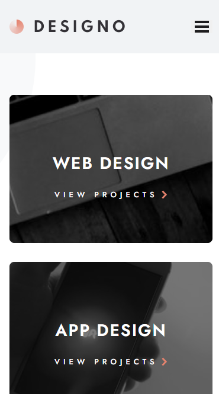
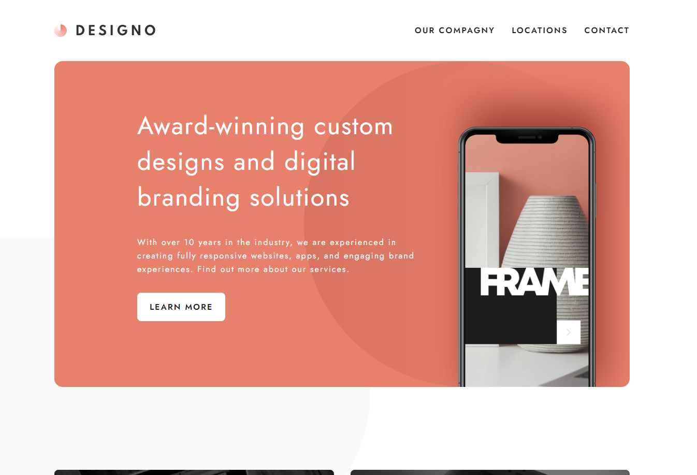

## Project Designo | Award-wining custom designs and digital brand solutions angency
- [Project on Github](https://github.com/Arteque/designo)
- [Project live](https://designo-zeta-opal.vercel.app/)

### Table of contents

- [Overview](#overview)
  - [Screenshot](#screenshot)
- [My process](#my-process)
  - [Built with](#built-with)
  - [What I learned](#what-i-learned)
  - [Continued development](#continued-development)
- [Author](#author)

### Overview:
**Designo** is a showcase website for a multinational digital branding agency.  
The **Designo Corporation** has multiple locations in Canada, Australia, and the United Kingdom. The agency is presented as professional and established, with over 10 years of experience in the branding industry.  
Designo creates *fully responsive websites, apps, and engaging brand experiences*.  
The website is designed to provide users with the optimal layout for each page based on their device's screen size, ensuring a seamless experience across desktops, tablets, and smartphones.

My role was to develop the website based on the provided design.

The users need to see the optimal layout for each page depending on their device's screen size visiting the **Designo** website

- Mobile view

- Desktop view

### My process
#### Built with:
The website was built using **React.js**, along with **React-Router-Dom V6** for navigation, and **Vite.js** as the build tool for optimized performance. The styling was implemented using **SCSS**, written in plain SCSS without any additional CSS frameworks. This approach allowed for greater flexibility and customization in the design process. By utilizing SCSS, the codebase remains modular and maintainable, making it easier to manage styling across different components. The use of Vite.js ensures faster builds and an improved development experience compared to traditional bundlers, enhancing the overall efficiency of the project.

### What I learned
This project allowed me to refine my existing expertise with **React.js**, **React-Router-Dom V6**, **SCSS**, and **Vite.js** by focusing on performance optimizations and scalability. I delved deeper into advanced **React** patterns, particularly in structuring complex state management and optimizing component re-rendering for a smoother user experience. The project also reinforced best practices in writing maintainable **SCSS** while ensuring responsive designs across a wide range of devices. With **Vite.js**, I explored advanced configuration options to enhance build speed and improve the overall development workflow.

### Continued Development

In the ongoing enhancement of the project, I have successfully added an extra **spam filter** to the contact form on the subpage. This implementation includes robust validation to minimize spam submissions and displays an error message to users when spam is detected. Additionally, I have integrated a confirmation component that appears once a message is successfully submitted. This feature provides users with immediate feedback, assuring them that their message has been received, thereby improving the overall user experience on the contact form.

### Author

- Website - [Ahmed Lemssiah](https://www.artecke.de)
- Frontend Mentor - [@Arteque](https://www.frontendmentor.io/profile/Arteque)
- Twitter - [@ArteckeDesign](https://twitter.com/ArteckeDesign)
- Youtube - [@artecke99999](https://www.youtube.com/channel/UCjzbCFOWdsdV6gxa5ho7EtQ)
- Instagram - [@artt3k](https://www.instagram.com/artt3k/)

